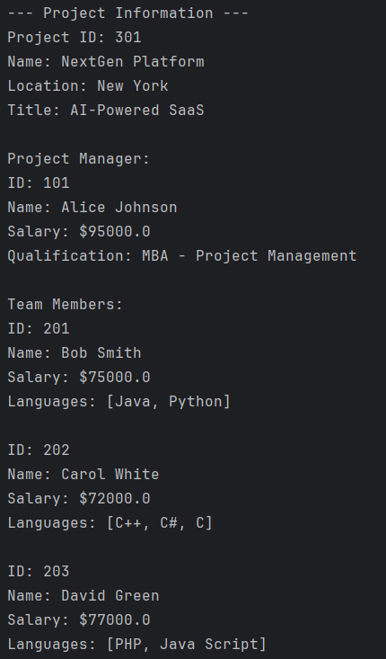

## 📚 Classes and Their Responsibilities

### 1. Employee (Base Class)
- Common attributes for all people:
  - id
  - name
- Common method:
  - displayInfo() → shows id, name (to be *overridden* by child classes)

---

### 2. SoftwareEngineer (Child Class of Employee)
- Inherits from Employee.
- Adds:
  - salary
  - languages: String[]
- Overrides:
  - displayInfo() → shows id, name, salary, languages.

---

### 3. ProjectManager (Child Class of Employee)
- Inherits from Employee.
- Adds:
  - salary
  - qualification
- Overrides:
  - displayInfo() → shows id, name, salary, qulification.

---

### 4. Project (Independent Class)
- Attributes:
  - id
  - name
  - location
  - title (title of the project)
  - *One* ProjectManager (assigned to the project)
  - *Many* SoftwareEngineer (as team members)
- Methods
  - displayInfo()
- Relationships:
  - *Association* with ProjectManager (one manager per project)
  - *Association* with SoftwareEngineer (many engineers per project)

---

## 🔥 OOP Concepts Used

| Concept         | How it is used                                |
|-----------------|------------------------------------------------|
| *Association* | Project *has a* ProjectManager and team (SoftwareEngineers). |
| *Inheritance* | SoftwareEngineer and ProjectManager *inherit* from Person. |
| *Override*    | Both override displayInfo() to show their details differently. |

---

## Main Method
  - create a `Project`
  - call the `displayInfo` Method

## 🌟 Expected Ouput
  
