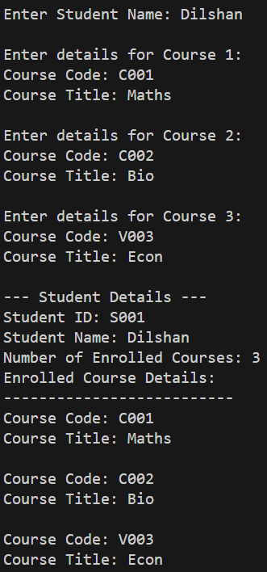

⬅️ [Previous](3.md) | [1](1.md) | [2](2.md) | [3](3.md) | [**`4`**](4.md) | [5-A](5-A.md) | [5-B](5-B.md) | ➡️ [Next](5-A.md)

### Question 04

Develop a **Student-Course Registration System** implementing a **unidirectional association** where:
- The `Student` class maintains references to courses they have enrolled in
- The `Course` class does **not** store any reference to students

---

#### Course Class Specifications
The `Course` class represents a university course with the following requirements:

**Attributes:**
- `courseCode` (String) - Course identifier
- `courseTitle` (String) - Course name

**Methods:**
- **Parameterized Constructor** - Initialize course attributes upon object creation
- `displayCourseDetails()` - Print course code and title to console

---

#### Student Class Specifications
The `Student` class models a student who can enroll in up to **three courses**.

**Attributes:**
- `studentID` (String) - Student identifier
- `studentName` (String) - Student's full name
- `enrolledCourses[]` (Course array) - Fixed-size array to store enrolled courses (size = 3)
- `courseCount` (int) - Track number of currently enrolled courses

**Methods:**
- **Default Constructor** - Initialize with empty course array
- **Parameterized Constructor** - Initialize student details
- `enrollCourse(Course course)` - Add course to array (only if `courseCount < 3`) if not show an error message.
- `displayStudentDetails()` - Print student information and all enrolled course details

---

### Implement the Main Class
- Get user inputs
- Create at least 3 Course objects with different details
- Create 1 Student object using parameterized constructor
- Use enrollCourse() to enroll student in all 3 courses
- Call displayStudentDetails() to show final output

---

  
🌟 Expected Output

  
  
  

⬅️ [Previous](3.md) | [1](1.md) | [2](2.md) | [3](3.md) | [**`4`**](4.md) | [5-A](5-A.md) | [5-B](5-B.md) | ➡️ [Next](5-A.md)

