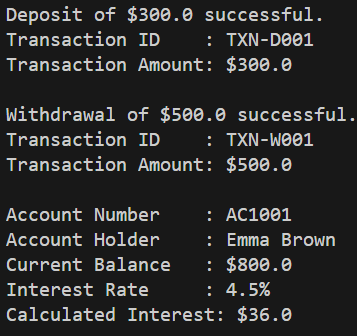

<div align="center">

⬅️ [Previous](3.md) | [1](1.md) | [2](2.md) | [3](3.md) | [**`4`**](4.md) | [5-A](5-A.md) | [5-B](5-B.md) | ➡️ [Next](5-A.md)

</div>

### Question 04

Develop a **Bank Account Management System** demonstrating **inheritance** and **dependency** (passing an object to another class method).

---

#### Account Class (Base Class)

The `Account` class represents a general bank account with the following:

**Attributes:**
- `accountNumber` (String) - Unique account number
- `accountHolderName` (String) - Name of the account holder
- `balance` (double) - Current balance

**Methods:**
- **Parameterized Constructor** - Initialize account attributes
- `displayAccountDetails()` - Print account number, holder name, and balance

---

#### SavingsAccount Class (Derived Class)

The `SavingsAccount` class inherits from `Account` and adds savings-specific features:

**Attributes:**
- `interestRate` (double) - Interest rate for the savings account

**Methods:**
- **Parameterized Constructor** - Initialize all attributes including base class attributes
- `calculateInterest()` - Calculate interest based on balance and interest rate
- `displaySavingsDetails()` - Print account details along with interest rate and calculated interest

---

#### Transaction Class

The `Transaction` class represents a bank transaction and demonstrates **dependency** by accepting an `Account` object to perform operations on.

**Attributes:**
- `transactionID` (String) - Unique transaction identifier
- `amount` (double) - Transaction amount

**Methods:**
- **Parameterized Constructor** - Initialize transaction attributes
- `processDeposit(Account account)` - Add `amount` to the account's balance
- `processWithdrawal(Account account)` - Subtract `amount` from the account's balance if sufficient funds exist; otherwise, print error
- `displayTransactionDetails()` - Print transaction ID and amount

#### All attribures must be `private` | `protected`, use `getter` or `setter` as you need.
---

### Implement the Main Class

- Create a `SavingsAccount` object using the parameterized constructor
- Create two `Transaction` objects: one for deposit and one for withdrawal
- Use `processDeposit()` and `processWithdrawal()` methods of `Transaction` by passing the `SavingsAccount` object (demonstrating dependency)
- finally `displaySavingsDetails()`

---

## Main Method Given below
```java
// Main Class
public class BankAccountManagementSystem {
    public static void main(String[] args) {
        // Step 1: Create SavingsAccount
        SavingsAccount savings = new SavingsAccount("AC1001", "Emma Brown", 1000.0, 4.5);

        // Step 2: Create Transactions
        Transaction deposit = new Transaction("TXN-D001", 300.0);
        Transaction withdrawal = new Transaction("TXN-W001", 500.0);

        // Step 3: Process Deposit
        deposit.displayTransactionDetails();
        deposit.processDeposit(savings);

        // Step 4: Process Withdrawal
        withdrawal.displayTransactionDetails();
        withdrawal.processWithdrawal(savings);

        savings.displayAccountDetails();
    }
}
```

<details>
  <summary style="font-size:22px; font-weight:bold">🌟 Expected Output</summary>
  
  
  
</details>

  
<div align="center">

⬅️ [Previous](3.md) | [1](1.md) | [2](2.md) | [3](3.md) | [**`4`**](4.md) | [5-A](5-A.md) | [5-B](5-B.md) | ➡️ [Next](5-A.md)

</div>